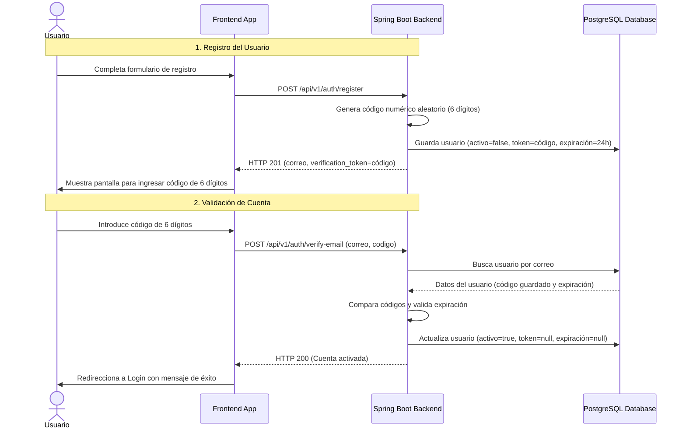

# Plan de Implementación: Verificación por Código de 6 Dígitos

Este plan detalla los pasos para migrar el sistema de verificación de cuentas del proyecto **EcoVolt**. Actualmente, se genera un token JWT temporal y se utiliza en un enlace enviado al usuario. El nuevo comportamiento generará un **código numérico de 6 dígitos** (ej. `382910`), que se enviará por correo electrónico y se validará desde la interfaz de usuario (frontend).

---

## 1. Diseño del Flujo de Trabajo (Workflow)



---

## 2. Cambios en el Backend (Spring Boot)

Para implementar el cambio en el backend, debemos modificar el DTO de verificación, actualizar la lógica de generación y validación en el servicio, y documentar el cambio en los archivos markdown correspondientes.

### Paso 2.1: Modificar `VerificarCorreoDto.java`
Dado que un código de 6 dígitos es propenso a colisiones si solo se busca por código en una base de datos grande, requeriremos enviar el **correo** junto con el **código** en la petición de verificación. Esto garantiza una validación rápida y segura.

```diff
package com.ecovolt.demo.dtos;

-import jakarta.validation.constraints.NotBlank;
+import jakarta.validation.constraints.Email;
+import jakarta.validation.constraints.NotBlank;
+import jakarta.validation.constraints.Pattern;
import lombok.Getter;
import lombok.Setter;

@Getter
@Setter
public class VerificarCorreoDto {

-    @NotBlank(message = "El token es obligatorio")
-    private String token;
+    @NotBlank(message = "El correo es obligatorio")
+    @Email(message = "El correo no tiene un formato válido")
+    private String correo;
+
+    @NotBlank(message = "El código es obligatorio")
+    @Pattern(regexp = "^\\d{6}$", message = "El código debe tener exactamente 6 dígitos numéricos")
+    private String codigo;
}
```

### Paso 2.2: Actualizar `AutenticacionService.java`
Reemplazaremos el uso de `JwtService` para la generación/validación del token de verificación por un generador numérico seguro (`SecureRandom`) y lógica de expiración directa.

```diff
    @Transactional
    public void verifyEmail(VerificarCorreoDto request) {
-        Usuario usuario = usuarioRepositorio.findByVerificationToken(request.getToken())
-                .orElseThrow(() -> new BadRequestException("El token de verificacion no es valido"));
-
-        if (!isVerificationTokenValid(request.getToken(), usuario)) {
-            throw new BadRequestException("El token de verificacion ha expirado");
-        }
+        Usuario usuario = usuarioRepositorio.findByCorreo(normalizeEmail(request.getCorreo()))
+                .orElseThrow(() -> new ResourceNotFoundException("No existe un usuario con el correo indicado"));
+
+        if (usuario.isActivo()) {
+            throw new BadRequestException("La cuenta ya se encuentra activa");
+        }
+
+        if (usuario.getVerificationToken() == null || !usuario.getVerificationToken().equals(request.getCodigo())) {
+            throw new BadRequestException("El código de verificación no es válido");
+        }
+
+        if (usuario.getVerificationTokenExpiresAt() == null || 
+            usuario.getVerificationTokenExpiresAt().isBefore(LocalDateTime.now())) {
+            throw new BadRequestException("El código de verificación ha expirado");
+        }

        usuario.setActivo(true);
        usuario.setVerificationToken(null);
        usuario.setVerificationTokenExpiresAt(null);
        usuarioRepositorio.save(usuario);
    }
```

Y actualizaremos los métodos auxiliares de generación y validación de tokens:

```diff
    private VerificacionEnviadaRespuestaDto simulateVerificationEmail(Usuario usuario) {
-        String link = "/api/v1/auth/verify-email?token=" + usuario.getVerificationToken();
+        String link = "/api/v1/auth/verify-email?email=" + usuario.getCorreo() + "&code=" + usuario.getVerificationToken();
        return new VerificacionEnviadaRespuestaDto(
                usuario.getCorreo(),
                usuario.getVerificationToken(),
                usuario.getVerificationTokenExpiresAt(),
                link
        );
    }

    private void assignVerificationToken(Usuario usuario) {
-        String token = jwtService.generateEmailVerificationToken(
-                usuario.getCorreo(),
-                VERIFICATION_TOKEN_EXPIRATION_MILLIS
-        );
-        usuario.setVerificationToken(token);
-        usuario.setVerificationTokenExpiresAt(LocalDateTime.ofInstant(
-                jwtService.extractExpiration(token).toInstant(),
-                ZoneId.systemDefault()
-        ));
+        // Generar un código aleatorio criptográficamente seguro de 6 dígitos numéricos
+        try {
+            java.security.SecureRandom secureRandom = java.security.SecureRandom.getInstanceStrong();
+            String codigo = String.format("%06d", secureRandom.nextInt(1000000));
+            usuario.setVerificationToken(codigo);
+            usuario.setVerificationTokenExpiresAt(LocalDateTime.now().plusHours(TOKEN_EXPIRATION_HOURS));
+        } catch (java.security.NoSuchAlgorithmException e) {
+            // Fallback usando Random si SecureRandom no está disponible
+            String codigo = String.format("%06d", new java.util.Random().nextInt(1000000));
+            usuario.setVerificationToken(codigo);
+            usuario.setVerificationTokenExpiresAt(LocalDateTime.now().plusHours(TOKEN_EXPIRATION_HOURS));
+        }
    }

-   private boolean isVerificationTokenValid(String token, Usuario usuario) {
-       try {
-           return jwtService.isEmailVerificationTokenValid(token, usuario.getCorreo());
-       } catch (RuntimeException ex) {
-           return false;
-       }
-   }
```

### Paso 2.3: Limpieza en `JwtService.java` (Opcional)
Se pueden eliminar los métodos dedicados a la verificación de correo electrónico, ya que no serán requeridos:
- `generateEmailVerificationToken(...)`
- `isEmailVerificationTokenValid(...)`
- La constante `EMAIL_VERIFICATION_TOKEN_TYPE`

---

## 3. Actualización de la Documentación

### Paso 3.1: Actualizar `docs/endpoints-frontend.md`
Se actualizará el cuerpo esperado para el endpoint `/verify-email`.

```diff
- - `POST http://localhost:8080/api/v1/auth/verify-email`
-   - Request body: `token` string requerido.
-   - Response `data`: `null`.
+ - `POST http://localhost:8080/api/v1/auth/verify-email`
+   - Request body: `correo` string email requerido, `codigo` string 6 dígitos requerido.
+   - Response `data`: `null`.
```

### Paso 3.2: Actualizar `docs/endpoints-pruebas.md`
Se actualizará la simulación de prueba para que refleje el nuevo JSON del cuerpo.

```diff
  ### Verificar correo

  ```http
  POST /api/v1/auth/verify-email
  ```

  ```json
  {
-   "token": "{{verification_token}}"
+   "correo": "usuario@ejemplo.com",
+   "codigo": "123456"
  }
  ```
```

---

## 4. Estrategia para el Frontend

Para ofrecer una excelente Experiencia de Usuario (UX) en la validación desde el frontend, se recomienda diseñar una pantalla con las siguientes características:

1. **Pantalla de Verificación Dedicada**:
   - Tras registrarse, redirigir al usuario a una página (ej. `/verificar-cuenta?email=correo@usuario.com`).
   - Mostrar el correo al que se le envió el código para que el usuario verifique si está correcto.
2. **Campos de Entrada Separados**:
   - En lugar de un campo de texto genérico, se sugiere mostrar **6 inputs independientes** alineados horizontalmente.
   - **Lógica UX con JavaScript**:
     - Al escribir un número en el input *N*, el cursor debe saltar automáticamente al input *N+1*.
     - Al presionar *Backspace* en un input vacío, el cursor debe volver al input *N-1*.
     - Permitir pegar (*Paste*) el código completo de 6 dígitos y distribuirlo automáticamente entre los 6 inputs.
3. **Reenvío de Código**:
   - Incluir un botón de "Reenviar código" con un temporizador (cuenta regresiva de 60 segundos) para evitar spam hacia la base de datos y simulación de correos.
